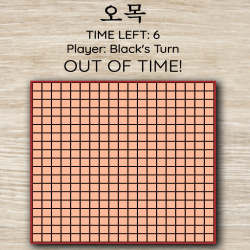

# 오목

Omok, 오목, Chinese Checkers, GO, is an abstract strategy board game. The rule is simple. First player to have 5 pieces in a row wins.

## Design:
Wire Frame

Product

* 19 x 19 board design

* Landing Page

* Minimalist design. Features are minimized until user explicitly looks for them.

## User Stories:
 * As a user, I can click start on the landing page and expect to be taken to the game.
 * As a user, I can expect to click new game and have the game reset.
 * As a user, I can expect to toggle CPU and play against the computer.
 * As a user, I can expect a winner to be declared at the end of the game.

## Features:
* Win Logic
* Keeps track of current player
* Declares winner and disables timer and game upon win
* New game button
* Choose to replay the last 5, 10, 15, or all moves
* CPU opponent

## Version:
0.9.1 → Draft design and heuristic ai implemented

0.9 → Alpha Build

## Implementation:
Two key algorithms

**Win Logic Algorithm**

* Similar to Tic-Tac-Toe we are checking for a line of *n* pieces. However Omok is different in that the *n* pieces required for a win do not need to equal the length/width of the board. This introduces a completely different challenge than Tic-Tac-Toe.
* The algorithm design is simple → 
  1. When a player chooses a cell 𝓐[𝔁, 𝔂] we need to check if the row, column, diagonal, and anti-diagonal is equal to a length of 5. 
  2. Pursuing the naive implementation of counting instances of *B* or *W* will lead to false positives. For example if 𝓐[𝔁, 𝔂] has 5 *B*'s present in column ğ”‚ğ“· to ğ”‚ğ“·+6 but is interrupted by a *W* or a *NIL*, it will return a false win.
  3. To remedy this issue, we perform a linear scan starting 𝓐[𝔁, 𝔂] to *NIL* for all columns, rows, and diagonals. If the counter at any point reaches 5, we immediately return a winner.
  4. If during the linear scan, we are interrupted by a *NIL* or the second player's piece we immediately break and perform a linear scan backwards. For example if checking a row at 𝓐[𝔁, 𝔂] we begin by scanning 𝓐[𝔁, 𝔂] to 𝓐[𝔁, ğ”‚ğ“·+𝓲] until we either reach 5 or are interrupted. If we are interrupted we then perform a linear scan backwards 𝓐[𝔁, ğ”‚ğ“·-𝓲] until iterruption. If we still have not returned a winner, we then perform the same check on the column and diagonals.
  5. The algorithm has a time complexity of 𝒪(𝓷) and a space complexity of 𝒪(1). Although the algorithm initially seems to have a long run time due to the length of its implementation, it is relatively fast, due to the fact that we break out of each loop early if it is not a valid placement. The worst case only occurs when we have to check every possible combination and fail to return a winner with each counter ending at 4. 

**CPU Algorithm**

* The CPU algorithm was relatively simple in theory, but it's execution was proven to be very difficult. I initially tried to implement the CPU using a variant of the `minimax` algorithm. However after finding that I would need to completely restructure my code, I opted to try a more heuristic/iterative method that consisted of 4 main components → `defensiveAction()`, `agressiveAction()`, `getPLS()`, and `getCLS()`. 
* It is important to note that the iterative algorithm is not as efficient or "smart" as `minimax`. This is because rather than using a binary decision tree, it uses a one-pass scan of the board caching indices of potential winning subarrays. The moves are cached in an object that sorts them by priority of the PLS/CLS.
* The algorithm is a "player-dependant" algorithm, meaning that if the player plays well, it will play well. If the player decides to randomly select squares it too will randomly defend squares rather than going for 5 in a row. It is however significantly more memory efficient that `minimax` since it does not need to recursively prune decision subtrees that would lead to a loss.

* The rules for the iterative AI are as follows → 
   1. The player is always white. 
   2. The computer's default value for Computer's Longest Sequence is always 1.
      * The Player's Longest Sequence (PLS) and Computer's Longest Sequence (CLS) are defined as the longest subarray that has a value 𝓷, where 0 < 𝓷 < 5 and is not blocked on both sides by a piece of the opposite color.
   3. When the player places a piece, look for the PLS. 
      * If the PLS is greater than the CLS call `defensiveAction()`.
         * `defensiveAction()` places a piece at the first available end of the PLS.
      * If the CLS is greather than the PLS call `agressiveAction()`.
         * `agressiveAction()` places a piece at the first available end of the CLS.
   4. Repeat step 3 until a winner is produced.

* The algorithm has a time complexity of 𝒪(𝓷) and a space complexity of 𝒪(𝓷). It's time complexity is due to the fact that we must store all player and computer moves in separate caches.

## Future Updates
 * Refactor the iterative "ai" and replace it with the `minimax` algorithm.
 * Refactor the html to reduce `div` tags written.
 * Refactor the caches that store moves. Changing them from objects to priority queues for a more efficient aglorithm.
